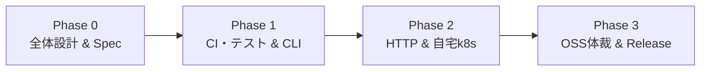

# 🗺️ lumitree 開発ロードマップ (ROADMAP.md)

本ドキュメントでは、`lumitree` の開発フェーズ、マイルストーン、各ステップの成果物および品質基準を定義します。

---

## 🎯 開発の基本原則
1. **責務の局所化 (Single Responsibility)**: TimeTree 公開カレンダーの取得・正規化・標準インターフェース（JSON / iCal / OpenAPI）提供に特化し、通知やDB保存等の外部ロジックは下流アプリに委ねる。
2. **テストファースト & CI 駆動 (Test-First & CI Assurance)**: 要件をフィクスチャ／モックテストとして先に定義し、PR ごとに CI（Lint / Test / Coverage）の通過を品質基準とする。
3. **再現性と軽量性 (Reproducible & Lightweight)**: 自宅 k8s 環境での安定稼働を目指し、最小限のリソース（メモリ数十MB以下）で常駐可能なシングルバイナリ／Distroless コンテナとする。

---

## 🗺️ フェーズ一覧

---

### 📦 Phase 0: 全体設計 & スキーマ策定 (Design & Spec)
> **目的**: システム全体像と標準データモデル（OpenAPI 3.0）を確定させ、実装のブレを防ぐ。

- [x] **0-1. システム全体像の確定**
  - アーキテクチャ図（Mermaid）の作成 ([docs/architecture.md](docs/architecture.md))
  - 責務境界（TimeTree ↔ lumitree ↔ 下流Bot/Portal/GCal）の合意
- [ ] **0-2. OpenAPI 3.0 仕様書の策定 (`api/openapi.yaml`)**
  - 正規化された `Calendar`, `Event`, `EventList` スキーマの定義
  - エンドポイント設計 (`GET /api/v1/calendars/{id}`, `GET /api/v1/calendars/{id}/events`, `GET /api/v1/calendars/{id}/events.ics`)
  - エラーレスポンス形式（RFC 7807 準拠または統一フォーマット）の定義
- [ ] **0-3. データマッピング仕様の整理**
  - TimeTree 生レスポンス（ミリ秒タイムスタンプ、未定義フィールド等）から標準モデルへの変換ルール策定

---

### 🧪 Phase 1: CI基盤・テスト整備 & コア実装（CLI / Adapter）
> **目的**: CI とテストハーネスを先に構築した上で、スタンドアロンで動作する Go 製 CLI ツールを完成させる。

- [ ] **1-1. CI 基盤 & テストハーネスの構築（テストファースト）**
  - GitHub Actions ワークフロー (`.github/workflows/ci.yml`):
    - `golangci-lint` による静的解析
    - `go test -race -coverprofile=coverage.out` によるテスト & カバレッジ計測
  - テスト用フィクスチャの準備 (`testdata/`):
    - TimeTree 初期 HTML（CSRF トークン抽出用サンプル）
    - TimeTree 内部 API レスポンス（正常系・異常系・境界値）
  - モック HTTP サーバー（`httptest.Server`）を用いた要件テストケースの作成
- [ ] **1-2. TimeTree Adapter & 正規化ロジックの実装（TDD）**
  - `pkg/timetree`: CSRF/Cookie ハンドシェイク、HTTP クライアント
  - `pkg/model`: 標準データ構造、ミリ秒 → ISO8601 / `time.Time` 変換
- [ ] **1-3. iCalendar Exporter の実装**
  - `pkg/exporter/ical`: RFC 5545 準拠の `.ics` 生成エンジン
  - タイトル、日時（JST/UTC）、場所、説明文、URL、UID の適切な出力検証
- [ ] **1-4. CLI インターフェースの実装**
  - `cmd/lumitree`:
    - `lumitree get <calendar_id>` (人間向けテーブル / `--json` 出力)
    - `lumitree ics <calendar_id>` (`.ics` 出力)
  - CLI の E2E テスト & コマンドヘルプ整備

**品質基準 (Quality Gate)**:
- すべての単体テスト・モックテストがパスし、CI が Green であること。
- `lumitree ics ilife_official` の出力が Mac / Google カレンダーでエラーなくインポートできること。

---

### ☸️ Phase 2: HTTP Server (Proxy/BFF) & 自宅 Kubernetes (k8s) デプロイ
> **目的**:常駐型プロキシサーバーを実装し、自宅 k8s クラスタ上で安定稼働・Webcal 配信させる。

- [ ] **2-1. OpenAPI 準拠 HTTP サーバーの実装**
  - `cmd/lumitree serve --port 8080`
  - ルーティング & ハンドラー:
    - `GET /api/v1/calendars/{id}`
    - `GET /api/v1/calendars/{id}/events`
    - `GET /api/v1/calendars/{id}/events.ics`
    - `GET /healthz` (Liveness / Readiness Probe)
  - **インメモリ TTL キャッシュ**:
    - デフォルト 10 分の TTL キャッシュ（TimeTree へのアクセス負荷・BAN 防止）
    - キャッシュバイパス / パージオプション
- [ ] **2-2. コンテナ化 & Kubernetes マニフェスト整備**
  - `Dockerfile`: Multi-stage build (Distroless / Scratch ベースの超軽量コンテナ)
  - `k8s/` マニフェスト (Kustomize または Helm):
    - `Deployment` (Resource requests/limits: CPU 50m, Mem 64Mi)
    - `Service` (ClusterIP)
    - `Ingress` (Cloudflare Tunnel または Traefik / cert-manager)
- [ ] **2-3. 自宅 k8s クラスタへのデプロイ & 結合検証**
  - GitOps (ArgoCD) または直接適用によるクラスタデプロイ
  - Google カレンダーからの「URL でカレンダーを追加」による実機自動同期テスト
  - 負荷・メモリリーク検証（長時間の常駐安定性確認）

**品質基準 (Quality Gate)**:
- 自宅 k8s 上で Pod が再起動（OOMKilled 等）なく安定稼働し、Ingress 経由で `.ics` と JSON が取得できること。

---

### 🚀 Phase 3: OSS 体裁 & リリース自動化 (CI/CD)
> **目的**: 一般公開可能な OSS としての体裁（マルチプラットフォームバイナリ配布、自動リリースノート、ドキュメント）を完成させる。

- [ ] **3-1. 自動ビルド & クロスコンパイル (GoReleaser)**
  - `.goreleaser.yaml` の設定:
    - Linux (amd64, arm64), macOS (amd64, arm64), Windows (amd64) 向けバイナリ生成
    - コンテナイメージの GHCR (GitHub Container Registry) への自動 Push
- [ ] **3-2. Release Notes & 変更履歴の自動生成**
  - Conventional Commits の導入
  - Release Drafter または GitHub Actions によるタグ作成時の自動リリースノート生成
- [ ] **3-3. ブランチ運用 & バージョニング規約**
  - Semantic Versioning (SemVer 2.0.0)
  - `main` ブランチ保護および `release/*` ブランチ / タグ運用の明文化
- [ ] **3-4. OSS ドキュメント整備**
  - `README.md` (バッジ、QuickStart、CLI 使い方、Docker/k8s 起動方法)
  - `CONTRIBUTING.md` (開発環境セットアップ、PR 作成ルール)
  - `LICENSE` (MIT License)
  - `SECURITY.md` (脆弱性報告ポリシー)
