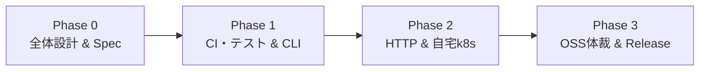

# 🗺️ lumitree 開発ロードマップ (ROADMAP.md)

本ドキュメントでは、`lumitree` の開発フェーズ、マイルストーン、各ステップの成果物および品質基準を定義します。

---

## 🎯 開発の基本原則
1. **責務の局所化 (Single Responsibility)**: TimeTree 公開カレンダーの取得・正規化・標準インターフェース（JSON / iCal / OpenAPI）提供に特化し、通知やDB保存等の外部ロジックは下流アプリに委ねる。
2. **テストファースト & CI 駆動 (Test-First & CI Assurance)**: 要件をフィクスチャ／モックテストとして先に定義し、PR ごとに CI（Lint / Test / Coverage）の通過を品質基準とする。
3. **再現性と軽量性 (Reproducible & Lightweight)**: 自宅 k8s 環境での安定稼働を目指し、最小限のリソース（メモリ数十MB以下）で常駐可能なシングルバイナリ／Distroless コンテナとする。
4. **スキーマ駆動と可観測性の確保 (Schema-Driven & Observability)**: OpenAPI を正としたコード生成、および適切な設定・ロギング設計を初期段階から組み込む。

---

## 🗺️ フェーズ一覧

---

### 📦 Phase 0: 全体設計 & スキーマ策定 (Design & Spec)
> **目的**: システム全体像と標準データモデル（OpenAPI 3.0）を確定させ、実装のブレを防ぐ。

- [x] **0-1. システム全体像の確定**
  - アーキテクチャ図（Mermaid）の作成 ([docs/architecture.md](docs/architecture.md))
  - 責務境界（TimeTree ↔ lumitree ↔ 下流Bot/Portal/GCal）の合意
  - 設計のトレードオフ（ADR）の明文化
- [x] **0-2. OpenAPI 3.0 仕様書の策定 (`api/openapi.yaml`)**
  - 正規化された `Calendar`, `Event`, `EventList` スキーマの定義
  - エンドポイント設計 (`GET /api/v1/calendars/{id}`, `GET /api/v1/calendars/{id}/events.ics` 等)
  - エラーレスポンス形式の定義
- [x] **0-3. データマッピング仕様の整理**
  - TimeTree 生レスポンス（ミリ秒タイムスタンプ等）から標準モデルへの変換ルール策定 ([spec/mapping.md](spec/mapping.md))

---

### 🧪 Phase 1: CI基盤・テスト整備 & コア実装（CLI / Adapter）
> **目的**: 運用に耐えうる可観測性（ログ・設定）とCIを備え、CLIツールとして完成させる。

- [x] **1-1. CI 基盤 & テストハーネスの構築**
  - GitHub Actions ワークフロー (`.github/workflows/ci.yml`): `golangci-lint`, `go test -race -cover`
  - テスト用フィクスチャの準備 (`testdata/`) と モックサーバーによる要件テストの作成
- [x] **1-2. 設定管理 (Config) と 構造化ロギング (Observability) の導入**
  - `log/slog` を用いた構造化ログの実装（JSON/Text）
  - 環境変数ベースの設定注入（`pkg/config`）: ログレベル、TTL、Port番号など
- [ ] **1-3. TimeTree Adapter & 正規化ロジックの実装（TDD）**
  - CSRF/Cookie ハンドシェイク、HTTP クライアント
  - OpenAPI 仕様から生成したモデルへのマッピング
- [ ] **1-4. iCalendar Exporter & CLI インターフェース**
  - RFC 5545 準拠の `.ics` 生成エンジン (`pkg/exporter/ical`)
  - `cmd/lumitree`: `get <calendar_id>`, `ics <calendar_id>` コマンド

**品質基準 (Quality Gate)**:
- すべての単体テストがパスし、CI が Green であること。
- `lumitree ics ilife_official` の出力が Mac / Google カレンダーでエラーなくインポートできること。

---

### ☸️ Phase 2: HTTP Server (Proxy/BFF) & 自宅 Kubernetes (k8s) デプロイ
> **目的**: OpenAPI 準拠の常駐型プロキシサーバーを実装し、自宅 k8s で安定稼働させる。

- [ ] **2-1. コード生成 (`oapi-codegen`) と OpenAPI 準拠 HTTP サーバー**
  - `api/openapi.yaml` から HTTP ハンドラインターフェースを自動生成
  - `cmd/lumitree serve` コマンドの実装
  - **インメモリ TTL キャッシュ**: デフォルト 10 分のキャッシュ（BAN 防止）
- [ ] **2-2. コンテナ化 & Kubernetes マニフェスト整備**
  - `Dockerfile`: Multi-stage build (Distroless / Scratch ベースの超軽量コンテナ)
  - `k8s/` マニフェスト: Deployment (CPU/Mem Limit), Service, Ingress
- [ ] **2-3. 自宅 k8s クラスタへのデプロイ & 結合検証**
  - GitOps (ArgoCD) または直接適用によるクラスタデプロイ
  - Google カレンダーからの自動購読同期テスト

**品質基準 (Quality Gate)**:
- 自宅 k8s 上で Pod が再起動（OOMKilled 等）なく安定稼働し、Ingress 経由で `.ics` と JSON が取得できること。

---

### 🚀 Phase 3: OSS 体裁 & リリース自動化 (CI/CD)
> **目的**: 個人開発の OSS としてオーバーエンジニアリングを避けつつ、自動化と信頼性を担保する。

- [ ] **3-1. 自動ビルド & リリースノート (Tag-based Release)**
  - Git-Flow のような複雑なリリースブランチは採用せず、`main` のタグトリガー（例: `v1.0.0`）による自動リリースを採用
  - GoReleaser によるマルチOSバイナリ自動生成 & GHCR コンテナ Push
- [ ] **3-2. 非公式 API 防衛策: Live Monitoring (E2E 定期監視)**
  - GitHub Actions の Cron (例: 1日1回) で、本番の TimeTree から実データを取得する E2E テストを実行
  - 仕様変更でパースが壊れた場合に即時検知して通知するカナリア運用の導入
- [ ] **3-3. OSS ドキュメント整備**
  - `README.md` (バッジ、QuickStart、Docker起動方法)、`LICENSE` (MIT)
