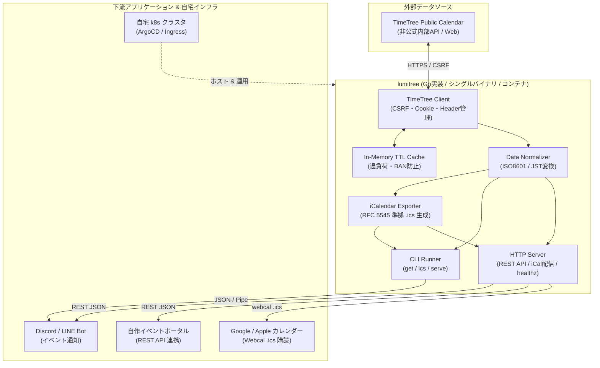

# lumitree システムアーキテクチャ & 全体像

`lumitree` は、TimeTree の公開カレンダー情報を取得・標準化し、CLI、標準 iCalendar (.ics)、および OpenAPI 準拠の REST API として提供する軽量な Adapter / Bridge ツールです。

---

## 1. 全体アーキテクチャ図 (System Overview)



---

## 2. 責務の分離と境界線 (Separation of Concerns)

| レイヤー | 責務（やること） | 責務外（やらないこと） |
| :--- | :--- | :--- |
| **lumitree (本プロジェクト)** | ・TimeTree 内部APIとのハンドシェイク・通信<br/>・データ正規化（ISO8601/JSTへの統一）<br/>・標準 iCal (`.ics`) / JSON 出力<br/>・OpenAPI 準拠のキャッシュ付き HTTP Proxy<br/>・自宅 k8s 用コンテナ提供 | ・Discord / LINE の通知・Bot ロジック<br/>・Google Calendar OAuth 認証<br/>・ポータルサイト用 DB 保存や UI 実装 |
| **下流アプリ (Bot / Portal)** | ・ユーザー向け通知、UI描画、独自DB管理 | ・TimeTree 固有の通信・CSRF解析 |
| **カレンダーアプリ (GCal/Apple)** | ・`.ics` URL を定期フェッチして予定表示 | ・自前でのデータスクレイピング |

---

## 3. データフロー

### ① CLI スタンドアロン実行時
```
[User / Cron] 
      │
      ▼ (lumitree ics ilife_official)
[CLI] ──► [Client] ──► [TimeTree HTML (CSRF)] ──► [TimeTree API]
                            │
                            ▼ (Raw JSON)
                      [Normalizer] ──► [ICS Exporter] ──► [Stdout / File (.ics)]
```

### ② HTTP Server (自宅 k8s デプロイ時)
```
[Google Calendar / Discord Bot / Web Portal]
      │
      ▼ (GET /api/v1/calendars/ilife_official/events.ics)
[HTTP Server (lumitree serve)]
      │
   [Cache Check] ──(Hit)──► [Return Cached .ics (Fast)]
      │ (Miss)
      ▼
[Client (Handshake & Fetch)] ──► [TimeTree]
      │
      ▼ (Normalize & Generate)
[Save to Cache] ──► [Return 200 OK + Content-Type: text/calendar]
```

---

## 4. 設計上のトレードオフと決定事項 (ADR)

本プロジェクトにおける重要な設計上の決定（Architecture Decision Record）と、そのトレードオフを以下に整理します。

### 4.1. In-Memory TTL Cache の採用
- **決定**: Redis などの外部キャッシュストアを用いず、Go プロセス内のメモリ上でキャッシュ（`sync.RWMutex` + `map` 等）を管理する。
- **メリット**: 外部依存（ミドルウェア）がなく、シングルバイナリとして極めて軽量に稼働する。デプロイ構成がシンプルになる。
- **デメリット**: Kubernetes 等で Pod を複数起動（スケールアウト）した場合、キャッシュが共有されず、Pod の数だけ TimeTree へのフェッチが発生する。
- **評価**: 個人運用の k8s であり、Replica 1 での運用が前提のため、このデメリットは許容可能（YAGNI原則）。

### 4.2. OpenAPI とコードの同期 (Code Generation)
- **決定**: `api/openapi.yaml` を正と扱い、`oapi-codegen` 等を用いて Go の型定義や HTTP ハンドラインターフェースを自動生成する。
- **メリット**: スキーマと実装の乖離を防ぎ、実装時の「迷子」をなくす。
- **デメリット**: ビルドチェーンにツール依存が増える。
- **評価**: APIプロキシとしての責務を果たす上では、スキーマファースト開発の恩恵が圧倒的に大きいため採用。

### 4.3. 非公式API利用に伴うリスクへの防衛策
- **決定**: TimeTree の内部 Web API は予告なく変更されるリスクがあるため、定期的な Live Monitoring（結合テスト）を運用基盤に組み込む。
- **対策**: GitHub Actions の Cron を用いて、1日1回など定期的に実際の TimeTree カレンダーに対して CLI で取得を試み、パースに失敗した場合に即時通知する仕組み（E2E カナリアテスト）を導入する。
