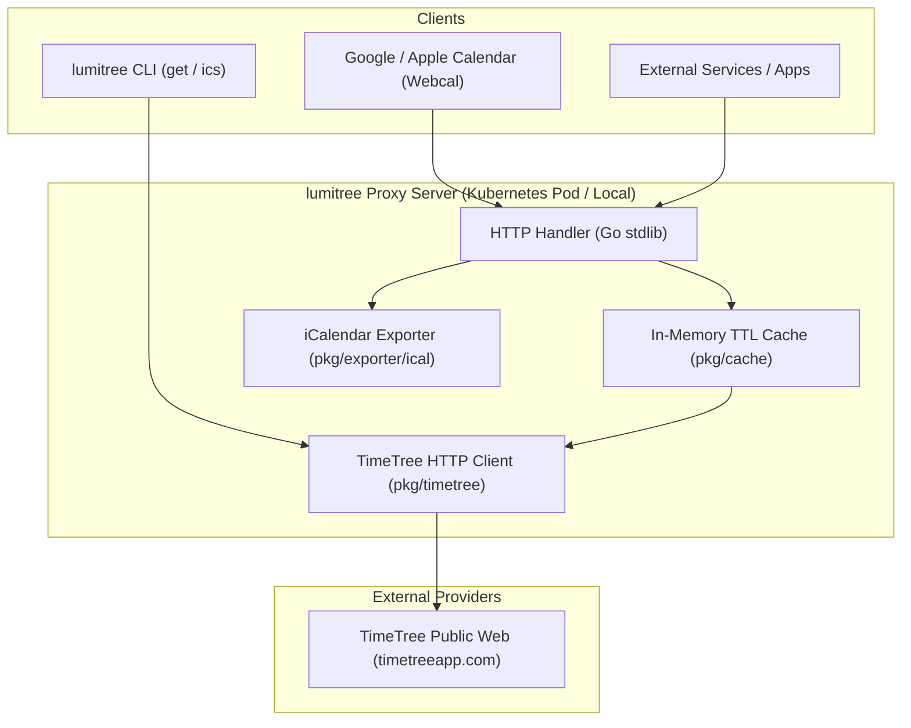
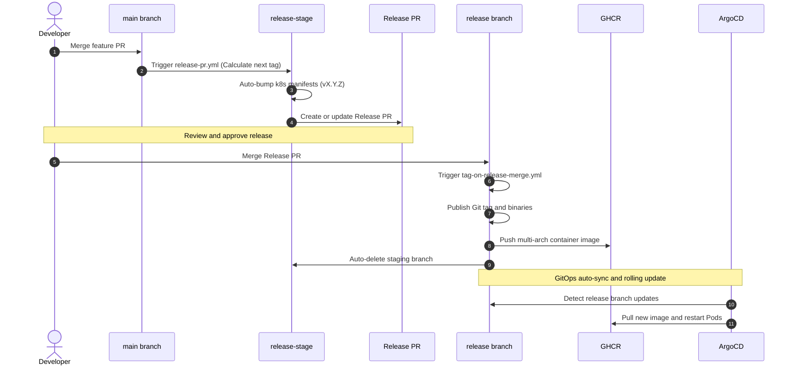

# lumitree システムアーキテクチャ & GitOps 運用設計

本書では、`lumitree` の全体アーキテクチャ、内部コンポーネント設計、および GitHub Actions と ArgoCD を用いた **Shift-Left GitOps リリースサイクル** について解説します。

---

## 1. システム全体構成

`lumitree` は、TimeTree 内部 API と各種クライアント（CLI、Google/Apple カレンダー、外部 REST API 消費者）の間を仲介するステートレスなプロキシ・アダプターです。



---

## 2. コア設計原則

### ① CSRF / セッション自動ハンドシェイク
TimeTree の内部 API は CSRF トークンと `_session_id` Cookie を要求します。`pkg/timetree` クライアントは初回アクセス時に公開ページ HTML を取得してトークンを抽出し、以降のリクエストに透過的に付与します。

### ② In-Memory キャッシュによる負荷軽減
同一カレンダーへのリクエストはデフォルトで 10 分間キャッシュされます。これにより、TimeTree 側への過度な負荷や IP レートリミット（429 Too Many Requests）を防止します。

### ③ OpenAPI 3.0.3 駆動 (Schema-First)
API インターフェースは `api/openapi.yaml` で一元定義され、`oapi-codegen` によって Go のクライアントコードが自動生成されます。CI の `Schema Drift Check` により、仕様書とコードの不整合が常に検出されます。

---

## 3. Shift-Left GitOps リリースサイクル (Pattern A)

本プロジェクトでは、保護ブランチ（`main`, `release`）のセキュリティルールを一切緩和せず、自動化されたパイプラインで Kubernetes マニフェストのバージョンタグを更新・デプロイする **Shift-Left GitOps モデル** を採用しています。



---

## 4. Kubernetes デプロイメント構成

自宅 Kubernetes クラスタ上でのリソース構成は以下の通りです：

| リソース | Namespace | 説明 |
| :--- | :--- | :--- |
| `Deployment` | `lumitree` | `ghcr.io/aobaiwaki123/lumitree:vX.Y.Z` (Distroless, 非特権ユーザー `nonroot:nonroot`) |
| `Service` | `lumitree` | ClusterIP (Port 8080) |
| `ConfigMap` | `lumitree` | ログ設定、キャッシュ TTL、サーバーポート |
| `Application` | `argocd` | GitOps 同期設定 (`targetRevision: release`, `selfHeal: true`, `prune: true`) |

### 実稼働検証コマンド
```bash
./scripts/verify-deploy.sh
```
このスクリプトは ArgoCD の同期状態、Pod の稼働状態、`/healthz` 疎通、REST API 疎通、iCalendar 出力疎通を自動で一括テストします。
